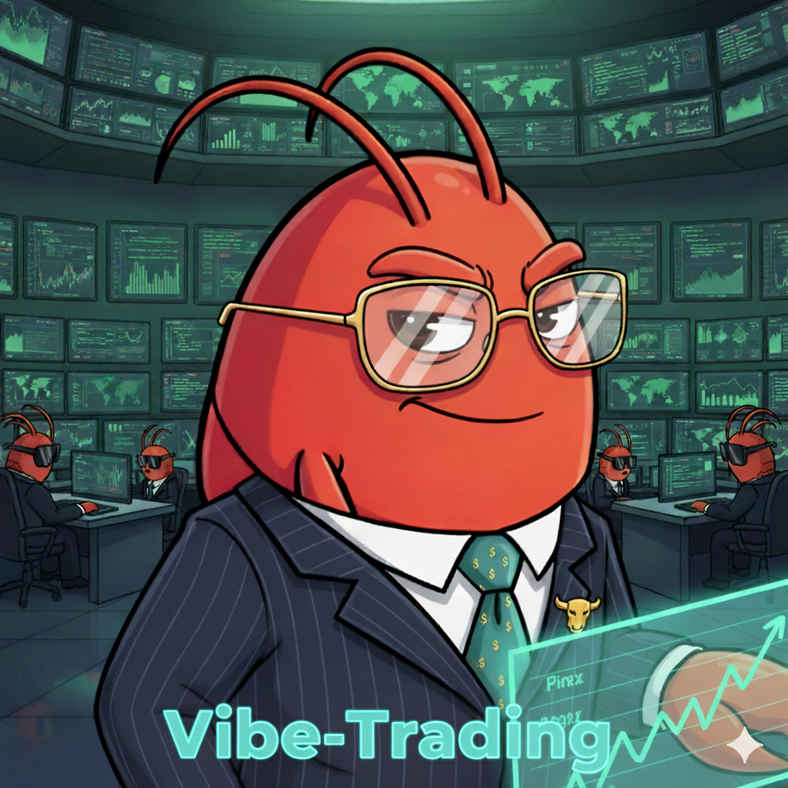

<div align="center">
  
  <h1>VibeTrading</h1>
  <p><b>AI-native quantitative trading research platform</b></p>

  [](https://www.python.org)
  [](https://fastapi.tiangolo.com)
  [](https://react.dev)
  [](https://www.docker.com)
  <br>
  [](LICENSE)
  [](https://github.com/DesusLove/VibeTrading/pulls)
  [](https://github.com/DesusLove/VibeTrading/stargazers)
</div>

---

VibeTrading is an **AI-powered trading research platform** that combines LLM agents with quantitative backtesting, factor research, and multi-broker connectivity. Research ideas, discover alpha, and deploy strategies — all through natural language or a real-time web dashboard.

---

## ✨ Features

<details open>
<summary><b>🧠 AI Research Agent</b></summary>
<br>
Chat-driven market analysis, strategy development, and backtesting. Just ask "what factors drive MSFT returns?" or "backtest a mean-reversion strategy on SPY".
</details>

<details>
<summary><b>📊 Alpha Zoo — 460+ Factors</b></summary>
<br>
Pre-built library of academic alpha factors with benchmarks, correlation matrices, and performance attribution — ready to screen, combine, and deploy.
</details>

<details>
<summary><b>🔗 Multi-Broker Trading</b></summary>
<br>
Paper trade across Robinhood, Interactive Brokers, Alpaca, Binance, OKX, Tiger Brokers, and more — all from a unified interface.
</details>

<details>
<summary><b>⚙️ Backtesting Engine</b></summary>
<br>
PIT-safe fundamental data, multi-asset support, Monte Carlo simulation, and factor attribution. Walk-forward validation built in.
</details>

<details>
<summary><b>🐝 Swarm Intelligence</b></summary>
<br>
Deploy multi-agent investment committees, quant desks, and risk committees that debate, vote, and manage portfolios collaboratively.
</details>

<details>
<summary><b>🌐 Data Layer</b></summary>
<br>
18+ free market data sources with automatic failover, intelligent caching, and global coverage — stocks, crypto, FX, futures, and options.
</details>

<details>
<summary><b>📈 Web Dashboard</b></summary>
<br>
Real-time chat, run details, correlation matrices, strategy comparison, and portfolio tracking — built with React 19 and ECharts.
</details>

<details>
<summary><b>💬 IM Channels</b></summary>
<br>
Deploy agents to Telegram, Discord, Slack, WeChat, and 12+ other messaging platforms.
</details>

---

## 🏗 Architecture

```
┌─────────────────────────────────────────────────────────────┐
│                     IM Channels (Telegram, Discord, etc.)    │
└───────────────────────────┬─────────────────────────────────┘
                            │
┌───────────────────────────▼─────────────────────────────────┐
│                   Web Dashboard (React 19)                   │
└───────────────────────────┬─────────────────────────────────┘
                            │ SSE / REST
┌───────────────────────────▼─────────────────────────────────┐
│              API Server (FastAPI + LangChain)                │
│  ┌──────────┐  ┌──────────┐  ┌──────────┐  ┌────────────┐  │
│  │ Research  │  │ Strategy │  │  Risk    │  │  Portfolio │  │
│  │  Agent    │  │  Agent   │  │  Agent   │  │   Agent    │  │
│  └──────────┘  └──────────┘  └──────────┘  └────────────┘  │
└───────────────────────────┬─────────────────────────────────┘
                            │
┌───────────────────────────▼─────────────────────────────────┐
│                 Data & Execution Layer                       │
│  ┌──────────┐  ┌──────────┐  ┌──────────┐  ┌────────────┐  │
│  │  18+     │  │  Alpha   │  │Backtest  │  │  Brokers   │  │
│  │ Sources  │  │   Zoo    │  │ Engine   │  │ (8+)       │  │
│  └──────────┘  └──────────┘  └──────────┘  └────────────┘  │
└─────────────────────────────────────────────────────────────┘
```

---

## 🚀 Quick Start

### pip install

```bash
pip install vibe-trading-ai
vibe-trading init
vibe-trading
```

Open **http://localhost:5899** and start researching.

### Docker

```bash
docker compose up
```

### From Source

```bash
git clone https://github.com/DesusLove/VibeTrading.git
cd VibeTrading
pip install -e .
vibe-trading init
vibe-trading
```

---

## 🧱 Stack

| Layer | Technology |
|-------|-----------|
| **Backend** | Python 3.11+, FastAPI, LangChain, LangGraph |
| **Frontend** | React 19, TypeScript, Vite, Tailwind CSS, ECharts |
| **Data** | pandas, NumPy, scikit-learn, DuckDB |
| **Infrastructure** | Docker, SSE streaming, MCP protocol |

---

## 📁 Project Structure

```
agent/         Python backend — API server, MCP tools, CLI
frontend/      React dashboard — chat UI, charts, strategy viewer
scripts/       Utility scripts for data ingestion, maintenance
tools/         Dev tooling — linting, formatting, CI helpers
wiki/          Documentation site
```

---

## 📄 License

Distributed under the **MIT License**. See [`LICENSE`](LICENSE) for more information.

---

<div align="center">
  <a href="https://github.com/DesusLove/VibeTrading/issues">Report Bug</a> ·
  <a href="https://github.com/DesusLove/VibeTrading/issues">Request Feature</a> ·
  <a href="https://github.com/DesusLove/VibeTrading/pulls">Submit PR</a>
  <br><br>
  <sub>Built with ❤️ for traders who code</sub>
</div>
